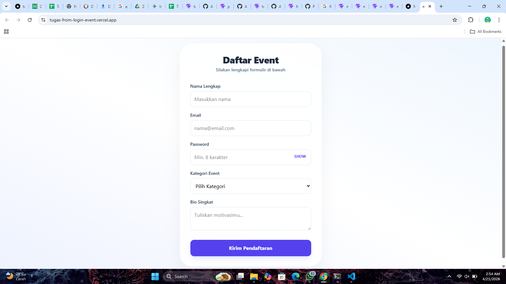

# 📝 Tugas Mandiri: Web Design System (Form Registrasi Event)

Tugas ini mengimplementasikan konsep Atomic Design (Atoms & Organisms) menggunakan React, TypeScript, dan Tailwind CSS.

---

## 🚀 Live Demo
Aplikasi telah di-deploy dan dapat diakses di:
👉 **[https://tugas-from-login-event.vercel.app/]**

---

## 📸 Screenshot Hasil Akhir
Berikut adalah tampilan form yang telah selesai dibangun:

---

## 🛠️ Fitur & Teknologi
- **Framework:** React + Vite
- **Styling:** Tailwind CSS v4 (Modern UI)
- **Validation:** Zod (Skema validasi sisi klien)
- **Form Handling:** React Hook Form
- **Components:** - **Atoms:** FormInput, Button (Reusable)
  - **Organisms:** RegistrationForm (Struktur Utama)

---

## 👤 Identitas Mahasiswa
- **Nama:** [ANGGA_DWI_RESKY_MAULANA]
- **NIM:** [24090034]
- **Prodi:** Teknik Informatika